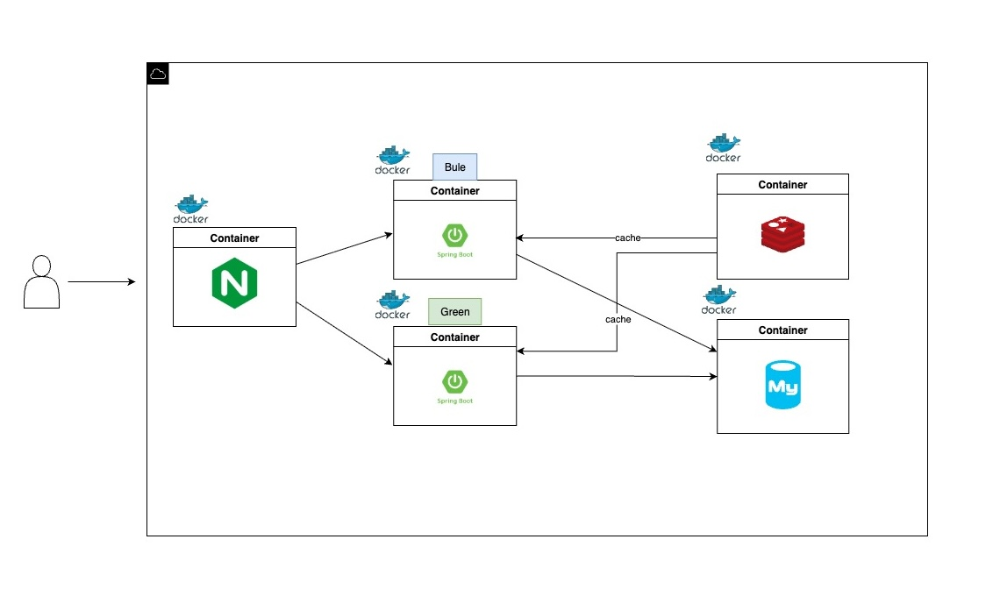

## 프로젝트

## 🚀 Getting Started
### Prerequisites

#### Running Docker Containers

`local` profile 로 실행하기 위하여 인프라가 설정되어 있는 Docker 컨테이너를 실행해주셔야 합니다.

```bash
docker-compose up -d
```

## 🏗 Architecture
### 구성요소
- **Nginx** 
  - 사용자의 요청을 받아 Blue/Green 인스턴스로 트래픽 분산
  - 배포 시 Target Group 전환을 통해 무중단 배포 지원

- **Spring Boot (Blue / Green)**
  - Docker 기반 Spring Boot 애플리케이션 실행
  - Blue: 현재 운영 버전
  - Green: 신규 배포 버전

- **Redis** 
  - 캐시 서버, DB 부하 분산 및 세션 관리

- **MySQL** 
  - 영속 데이터 저장소



### 📦 Deployment Strategy
- Blue-Green Deployment 전략을 채택하여 무중단 배포 지원
  - Blue 컨테이너: 현재 서비스 중인 애플리케이션 
  - Green 컨테이너: 신규 버전 배포 테스트 및 전환용
  - 신규 버전 배포 시 Green 인스턴스에 배포 후 헬스체크 확인
  - Nginx가 트래픽을 Blue ↔ Green으로 스위칭하여 무중단 배포를 지원