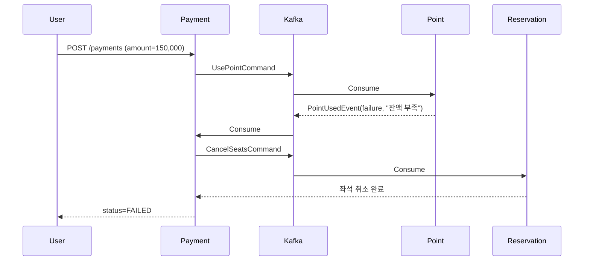

# 콘서트 예약 시스템 부하 테스트 계획서

## 1. Executive Summary

### 1.1 테스트 목적

콘서트 티켓 예약 시스템의 실 서비스 배포 전, **동시 접속자 급증 상황에서의 시스템 안정성 및 성능 검증**을 목적으로 합니다.

### 1.2 기대 효과

- **서비스 장애 사전 방지**: 실제 트래픽 유입 전 병목 구간 및 시스템 한계점 파악
- **인프라 비용 최적화**: 적정 서버 스펙 및 Auto-Scaling 임계값 도출로 과다/과소 프로비저닝 방지
- **SLA 달성 근거 마련**: 예상 트래픽 대비 응답시간 및 처리량 정량적 검증
---

## 2. 테스트 대상 선정 및 우선순위

### 2.1 테스트 대상 API

현재 시스템은 **토큰 기반 대기열 + 좌석 예약 + Saga 기반 결제 프로세스**로 구성되어 있으며, 다음 API가 부하 테스트 대상입니다:

| 우선순위 | API Endpoint | 설명 | 선정 이유 |
|---------|------------|------|----------|
| **P0** | `POST /api/v1/queues/tokens/{targetId}` | 대기열 토큰 발급 | 티켓 오픈 시 **최초 진입점**으로 가장 높은 동시성 발생 |
| **P0** | `POST /api/v1/queues/enter` | 대기열 입장 및 상태 확인 | 30분 동안 반복 폴링되는 구조로 **지속적 부하** 발생 |
| **P1** | `POST /api/v1/reservations/{showId}` | 좌석 예약 | **분산락 + 멱등성 처리**가 적용된 핵심 비즈니스 로직 |
| **P1** | `POST /api/v1/payments/` | 결제 처리 (Saga) | **Kafka 기반 분산 트랜잭션** + Outbox Pattern 검증 필요 |
| **P2** | `GET /api/v1/concerts/` | 콘서트 목록 조회 | Read-heavy 트래픽 및 캐싱 전략 검증 |
| **P2** | `POST /api/v1/users/me/points/charges` | 포인트 충전 | 동시 충전 요청 시 **동시성 제어** 검증 |

### 2.2 선정 근거

#### 2.2.1 대기열 토큰 발급 (P0)

**왜 이 API를 테스트해야 하는가?**

1. **트래픽 집중도**: 티켓 오픈 시점(T+0초)에 수만 명의 사용자가 동시에 토큰 발급 요청
   - 예상 동시 접속자: 10,000명 (첫 10초 내)
   - 현재 구현: Redis 기반 대기열 + MySQL Unique Constraint (target_id, user_id)

2. **현재 시스템 제약**:
   ```yaml
   queue:
     capacity: 50              # 입장 가능 인원 50명
     waiting-ttl-seconds: 1800 # 대기열 30분 유지
   ```
   - 50명 초과 시 나머지는 WAITING 상태로 대기
   - 대기열 위치 계산 쿼리: `SELECT COUNT(*) WHERE status='WAITING' AND id < ?`
   - **잠재적 병목**: 동시 발급 시 DB 커넥션 풀 고갈 우려

3. **테스트 목표**:
   - 초당 1,000건 요청 시 응답시간 95%ile < 500ms 달성 여부
   - DB 커넥션 풀(최대 5개) 충분성 검증
   - Redis TTL 기반 토큰 만료 정확성 확인

#### 2.2.2 좌석 예약 (P1)

**왜 이 API를 테스트해야 하는가?**

1. **동시성 제어 복잡도**:
   ```java
   // ReservationController.java:95-108
   @PostMapping("/{showId}")
   public ResponseEntity<ReservationResponse> createReservation(
       @RequestHeader("Idempotency-Key") String requestId,
       @RequestHeader("Queue-Token") String queueToken,
       ...
   ) {
       // 1. 대기열 토큰 검증
       // 2. 좌석 중복 예약 방지 (분산락)
       // 3. 멱등성 보장 (Idempotency-Key)
   ```
   - **분산락 대기시간**: 최대 3초 (application.yml:125)
   - **락 점유시간**: 최대 10초 (application.yml:126)
   - **동시 예약 경쟁 시나리오**: 100명이 같은 좌석 동시 클릭

2. **현재 시스템 제약**:
   ```yaml
   reservation:
     hold-minutes: 10              # 좌석 임시 점유 시간
     max-seats-per-reservation: 4  # 최대 4석
     max-retry-count: 3
   distributed-lock:
     reservation:
       wait-time: 3s               # 락 대기 최대 3초
       lease-time: 10s             # 락 점유 최대 10초
   ```

3. **테스트 목표**:
   - 동일 좌석에 대한 100건 동시 요청 시 **정확히 1명만 성공** 검증
   - 분산락 timeout 발생률 < 5%
   - 멱등성 키로 인한 중복 처리 방지 검증

#### 2.2.3 결제 처리 - Saga Pattern (P1)

**왜 이 API를 테스트해야 하는가?**

1. **분산 트랜잭션 복잡도**:
   ```
   Payment 생성 (PENDING)
   → Kafka: UsePointCommand
   → Point 차감
   → Kafka: PointUsedEvent
   → Payment 상태 PROCESSING
   → Kafka: ConfirmSeatsCommand
   → Reservation 확정
   → Kafka: SeatsConfirmedEvent
   → Payment 상태 COMPLETED
   ```
   - **총 8단계의 비동기 처리** (정상 흐름 기준)
   - Outbox Scheduler 주기: 5초 (application.yml:116)

2. **현재 시스템 제약**:
   ```yaml
   kafka:
     producer:
       acks: all              # 모든 replica 확인 (레이턴시 증가)
       retries: 3
     consumer:
       max-poll-records: 100  # 배치 처리
   outbox:
     scheduler:
       publish-interval-ms: 5000   # 5초마다 PENDING 이벤트 발행
       retry-interval-ms: 60000    # 실패 시 1분 후 재시도
       max-retries: 3
   ```

3. **테스트 목표**:
   - 동시 100건 결제 요청 시 **모든 Saga가 완료**되는 시간 측정
   - 포인트 부족 시나리오에서 **보상 트랜잭션 100% 성공** 검증
   - Kafka Consumer Lag < 1초 유지 가능 여부
   - Outbox 테이블 PENDING 적체 발생 여부

#### 2.2.4 대기열 상태 확인 (P0)

**왜 이 API를 테스트해야 하는가?**

1. **폴링 트래픽 증폭**:
   ```javascript
   // 클라이언트 예상 폴링 주기
   setInterval(() => {
     fetch('/api/v1/queues/enter', {
       headers: { 'Queue-Token': token }
     })
   }, 3000) // 3초마다 상태 확인
   ```
   - 대기열 인원 10,000명 × 3초마다 폴링 = **3,333 req/sec**
   - 30분 대기 시 총 600,000건 요청

2. **현재 시스템 제약**:
   - 대기 순번 계산: `SELECT COUNT(*) WHERE status='WAITING' AND expires_at > NOW() AND id < ?`
   - 인덱스: `ix_queue_wait(target_id, status, expires_at, id)`
   - **잠재적 병목**: 높은 빈도의 COUNT 쿼리로 인한 DB 부하

3. **테스트 목표**:
   - 지속적 3,000 req/sec 트래픽 30분간 유지 가능 여부
   - 응답시간 99%ile < 1초
   - Redis 메모리 사용량 및 CPU 사용률 모니터링

---

## 3. 테스트 시나리오

### 3.1 시나리오 1: 티켓 오픈 시뮬레이션 (Spike Test)

**목적**: 티켓 오픈 순간의 급격한 트래픽 스파이크 대응 능력 검증

```
사용자 수
  10,000 ┤     ╭─────╮
         │    ╱       ╲
   5,000 │   ╱         ╲
         │  ╱           ╲___
       0 └─┴─────────────────┴─→ 시간
         0s 10s      60s    120s
```

**시나리오 단계**:

1. **준비 (T-10s ~ T-0s)**:
   - 10,000명 가상 사용자 준비
   - Concert ID = 1 (특정 인기 공연)

2. **Spike (T+0s ~ T+10s)**:
   ```
   VirtualUser#1-10000: POST /api/v1/queues/tokens/1
   Header: Idempotency-Key: ${uuid()}
   Auth: Bearer ${user_token}

   Expected:
   - 50명 → status=ENTERED (즉시 입장)
   - 9,950명 → status=WAITING (대기)
   ```

3. **Polling (T+10s ~ T+1800s, 30분)**:
   ```
   Every 3 seconds:
     POST /api/v1/queues/enter
     Header: Queue-Token: ${token_from_step2}

   IF status=ENTERED:
     STOP polling
   ```

4. **예약 시도 (ENTERED 사용자)**:
   ```
   POST /api/v1/reservations/101  # showId=101
   Body: { seatIds: [1, 2] }
   Header: Idempotency-Key: ${uuid()}
   Header: Queue-Token: ${queue_token}

   Expected:
   - 200: 예약 성공 (expiresAt 반환)
   - 409: 좌석 이미 점유됨
   ```

5. **결제 (예약 성공 사용자)**:
   ```
   POST /api/v1/payments/
   Body: {
     reservationId: ${reservation_id},
     amount: 150000
   }
   Header: Idempotency-Key: ${uuid()}

   Expected:
   - 200: 결제 성공 (Saga 완료 대기)
   - 모니터링: payment.status가 COMPLETED로 변경되는 시간
   ```

**성공 기준**:
- [ ] 토큰 발급 API 응답시간 95%ile < 500ms
- [ ] 대기열 상태 확인 API 응답시간 99%ile < 1초
- [ ] 예약 API 중복 방지율 100% (동일 좌석에 1명만 성공)
- [ ] 결제 Saga 완료율 > 99% (포인트 부족 제외)
- [ ] DB 커넥션 풀 고갈 발생 0건
- [ ] 5xx 에러율 < 0.1%

### 3.2 시나리오 2: 동시 예약 경쟁 (Concurrency Test)

**목적**: 동일 좌석에 대한 동시 예약 요청 시 분산락 정확성 검증

```
100명이 동일 좌석(seat_id=1)을 동시에 예약 시도
→ 정확히 1명만 성공해야 함
```

**테스트 케이스**:

| Case | 동시 사용자 | 대상 좌석 | 예상 결과 |
|------|-----------|----------|----------|
| TC-1 | 100명 | 동일 좌석 1개 | 1명 성공, 99명 실패(409) |
| TC-2 | 100명 | 서로 다른 좌석 100개 | 100명 성공 |
| TC-3 | 50명 × 2회 | 동일 좌석 (Idempotency-Key 동일) | 1명 성공, 49명 멱등성 응답(200, 동일 reservationId) |

**K6 스크립트 예시**:
```javascript
import http from 'k6/http';
import { check } from 'k6';

export const options = {
  vus: 100,
  duration: '1s',
};

export default function () {
  const res = http.post(
    'http://localhost:8080/api/v1/reservations/101',
    JSON.stringify({ seatIds: [1] }),  // 모두 동일 좌석
    {
      headers: {
        'Content-Type': 'application/json',
        'Idempotency-Key': `${__VU}-${__ITER}`,
        'Queue-Token': 'valid-entered-token',
        'Authorization': 'Bearer test-user-token',
      },
    }
  );

  check(res, {
    'status is 200 or 409': (r) => r.status === 200 || r.status === 409,
  });
}
```

**성공 기준**:
- [ ] 정확히 1명만 200 OK 응답
- [ ] 나머지 99명은 409 Conflict 응답
- [ ] 분산락 timeout으로 인한 500 에러 0건
- [ ] DB에 1건만 INSERT 확인 (`SELECT COUNT(*) FROM reservation WHERE show_id=101 AND seat_id=1`)

### 3.3 시나리오 3: Saga Pattern 보상 트랜잭션 (Failure Simulation)

**목적**: 포인트 부족 시나리오에서 보상 트랜잭션 정확성 검증

```
1. 사용자 포인트 잔액: 10,000원
2. 예약 금액: 150,000원
3. 결제 시도 → 포인트 부족 → 자동 취소 검증
```

**테스트 흐름**:



**검증 포인트**:
```sql
-- 1. Payment 상태 확인
SELECT status FROM payment WHERE id = ?;
-- Expected: FAILED

-- 2. Reservation 상태 확인
SELECT status FROM reservation WHERE id = ?;
-- Expected: CANCELLED

-- 3. Seat 상태 확인
SELECT status FROM seat WHERE id = ?;
-- Expected: AVAILABLE (다시 예약 가능)

-- 4. Outbox 이벤트 확인
SELECT event_type, status FROM payment_outbox
WHERE aggregate_id = ? ORDER BY created_at;
-- Expected:
-- 1. UsePointCommand (PUBLISHED)
-- 2. CancelSeatsCommand (PUBLISHED)
```

**성공 기준**:
- [ ] 보상 트랜잭션 완료율 100%
- [ ] 보상 완료 시간 < 10초 (Outbox Scheduler 주기 5초 × 2)
- [ ] 좌석 상태 AVAILABLE로 복구 확인
- [ ] Outbox 테이블에 FAILED 상태 이벤트 0건 (재시도 성공)

### 3.4 시나리오 4: 장시간 부하 내구성 (Soak Test)

**목적**: 30분간 지속적인 트래픽 유지 시 메모리 누수, 커넥션 풀 관리 검증

```
사용자 수
  1,000 ┤ ──────────────────────────────
        │
    500 │
        │
      0 └───────────────────────────────→ 시간
        0s              30분         60분
```

**부하 패턴**:
- 동시 접속자: 1,000명
- 지속 시간: 30분
- 요청 분포:
  - 70%: `POST /api/v1/queues/enter` (폴링)
  - 20%: `GET /api/v1/concerts/` (목록 조회)
  - 10%: `POST /api/v1/reservations/{showId}` (예약)

**모니터링 메트릭**:

| 메트릭 | 정상 범위 | 알람 임계값 |
|-------|----------|-----------|
| Heap Memory 사용률 | < 70% | > 85% |
| DB 커넥션 풀 사용률 | < 80% | > 90% |
| Redis 메모리 사용량 | < 500MB | > 1GB |
| Response Time 95%ile | < 1s | > 3s |
| Error Rate | < 0.1% | > 1% |
| Kafka Consumer Lag | < 100 messages | > 1,000 |

**성공 기준**:
- [ ] 30분 동안 메모리 사용량 상승률 < 10% (메모리 누수 없음)
- [ ] DB 커넥션 풀 고갈 0건
- [ ] GC Pause 시간 < 100ms
- [ ] 응답시간 지속적 증가 없음 (성능 저하 없음)

---

## 4. 테스트 환경 구성

### 4.1 인프라 요구사항

#### 4.1.1 Application Server

```
- Instance Type: AWS EC2 t3.large (2 vCPU, 8GB RAM) × 2대
- Auto Scaling: CPU > 70% 시 scale-out (최대 4대)
- Load Balancer: AWS ALB (Application Load Balancer)
```

**사유**:
- 현재 HikariCP 최대 커넥션 5개 → 2대 배포 시 총 10개 커넥션
- Heap 메모리 6GB 할당 (XMx6g)

#### 4.1.2 Database

```
- Instance: AWS RDS MySQL 8.0
- Instance Type: db.r5.large (2 vCPU, 16GB RAM)
- Storage: 100GB gp3 (3000 IOPS)
- Multi-AZ: Yes (고가용성)
```

**사유**:
- InnoDB Buffer Pool: 12GB 할당
- 동시 커넥션 최대 200개 (max_connections)

#### 4.1.3 Redis

```
- Instance: AWS ElastiCache Redis 7.0
- Instance Type: cache.r5.large (2 vCPU, 13.07GB RAM)
- Cluster Mode: Disabled (단일 샤드)
```

**사유**:
- 대기열 토큰 10,000개 × 1KB ≈ 10MB
- TTL 30분 자동 만료

#### 4.1.4 Kafka

```
- Instance: AWS MSK (Managed Streaming for Kafka) 2.8.1
- Broker: 3대 (kafka.m5.large)
- Storage: 100GB per broker
```

**사유**:
- Replication Factor: 3 (데이터 유실 방지)
- Partition: 각 토픽 3개 (병렬 처리)

### 4.2 부하 발생 도구

**도구**: K6 + Grafana Cloud

**선정 이유**:
- Go 기반 경량 클라이언트 (높은 동시성 지원)
- JavaScript 기반 시나리오 작성 (개발자 친화적)
- Grafana Cloud 무료 연동 (실시간 모니터링)

**설치 및 실행**:
```bash
# K6 설치 (macOS)
brew install k6

# 테스트 실행
k6 run \
  --vus 10000 \
  --duration 30s \
  --out cloud \
  scenarios/spike-test.js
```

### 4.3 모니터링 스택

| 도구 | 용도 | 메트릭 예시 |
|-----|------|-----------|
| **Grafana** | 실시간 대시보드 | Response Time, Throughput, Error Rate |
| **Prometheus** | 메트릭 수집 | JVM Heap, DB Connection Pool, GC |
| **CloudWatch** | AWS 리소스 모니터링 | RDS CPU, ElastiCache Memory, ALB Request Count |
| **Kafka Manager** | Kafka 클러스터 상태 | Consumer Lag, Topic Partition, Broker Status |

**대시보드 구성**:
```
┌─────────────────────────────────────────────────┐
│ Response Time (95%ile)       [1.2s] ↑ +15%     │
│ Throughput                   [850 req/s]       │
│ Error Rate                   [0.05%]           │
├─────────────────────────────────────────────────┤
│ DB Connection Pool (5/5)     [100%] ⚠️         │
│ Redis Memory                 [125MB / 13GB]    │
│ Kafka Consumer Lag           [23 messages]     │
├─────────────────────────────────────────────────┤
│ JVM Heap Usage               [4.2GB / 6GB]     │
│ GC Pause (avg)               [45ms]            │
└─────────────────────────────────────────────────┘
```

---

## 5. 성공 기준 및 의사결정 매트릭스

### 5.1 정량적 목표

| 메트릭 | 목표값 | 허용 범위 | 조치 필요 |
|-------|-------|----------|----------|
| **Response Time (95%ile)** | < 1s | 1~2s | > 2s |
| **Throughput** | > 1,000 req/s | 800~1,000 | < 800 |
| **Error Rate** | < 0.1% | 0.1~0.5% | > 0.5% |
| **DB Connection Pool 사용률** | < 70% | 70~85% | > 85% |
| **Kafka Consumer Lag** | < 100 messages | 100~500 | > 500 |
| **Saga 완료 시간** | < 10s | 10~20s | > 20s |
| **보상 트랜잭션 성공률** | 100% | > 99% | < 99% |

### 5.2 의사결정 트리

```
부하 테스트 결과
    ├─ 모든 메트릭 목표값 달성
    │   → ✅ 배포 승인
    │
    ├─ 일부 메트릭 허용 범위
    │   ├─ DB 커넥션 풀 85% 사용
    │   │   → HikariCP maximum-pool-size: 5 → 10 증가
    │   │
    │   ├─ Response Time 1.5s
    │   │   → Redis 캐싱 적용 (콘서트 목록 조회)
    │   │
    │   └─ Kafka Consumer Lag 300 messages
    │       → Consumer concurrency: 3 → 5 증가
    │
    └─ 조치 필요 수준 도달
        ├─ DB CPU > 90%
        │   → RDS 인스턴스 업그레이드 (db.r5.large → db.r5.xlarge)
        │
        ├─ Error Rate > 1%
        │   → 코드 레벨 버그 수정 후 재테스트
        │
        └─ 보상 트랜잭션 실패
            → Outbox Scheduler 주기 조정 또는 재시도 로직 강화
```
---

## 6. 리스크 관리

### 6.1 잠재적 리스크

| 리스크 | 발생 가능성 | 영향도 | 대응 방안 |
|-------|-----------|-------|----------|
| **DB 커넥션 풀 고갈** | 높음 | 치명적 | HikariCP 설정 최적화, Read Replica 추가 |
| **Redis 메모리 부족** | 중간 | 높음 | TTL 단축, 인스턴스 업그레이드 |
| **Kafka 메시지 적체** | 중간 | 높음 | Consumer 병렬도 증가, Partition 수 증가 |
| **Outbox PENDING 적체** | 중간 | 중간 | Scheduler 주기 단축 (5s → 2s) |
| **네트워크 Timeout** | 낮음 | 중간 | ALB Idle Timeout 조정 |

### 6.2 Rollback 계획

테스트 중 운영 환경 영향 발생 시:

1. **즉시 중단**: K6 프로세스 Kill
2. **트래픽 차단**: ALB Target Group에서 테스트 서버 제거
3. **데이터 정리**: 테스트 데이터 삭제 스크립트 실행
   ```sql
   DELETE FROM queue_token WHERE created_at > '2025-12-26 00:00:00';
   DELETE FROM reservation WHERE created_at > '2025-12-26 00:00:00';
   ```
4. **서비스 재시작**: 애플리케이션 재배포

## 7 결론

### 7.1 요약

콘서트 예약 시스템의 안정적 서비스 제공을 위해 **대기열 토큰 발급**, **동시 좌석 예약**, **Saga 기반 결제 처리**라는 3대 핵심 기능에 대한 부하 테스트가 필수적입니다.

### 7.2 기대 효과

1. **서비스 신뢰성 향상**: 실제 트래픽 패턴 시뮬레이션을 통한 장애 사전 방지
2. **비용 최적화**: 과다 프로비저닝 방지 및 적정 Auto-Scaling 설정
3. **의사결정 근거**: 데이터 기반의 인프라 투자 의사결정
4. **팀 역량 강화**: 부하 테스트 노하우 축적 및 내재화

